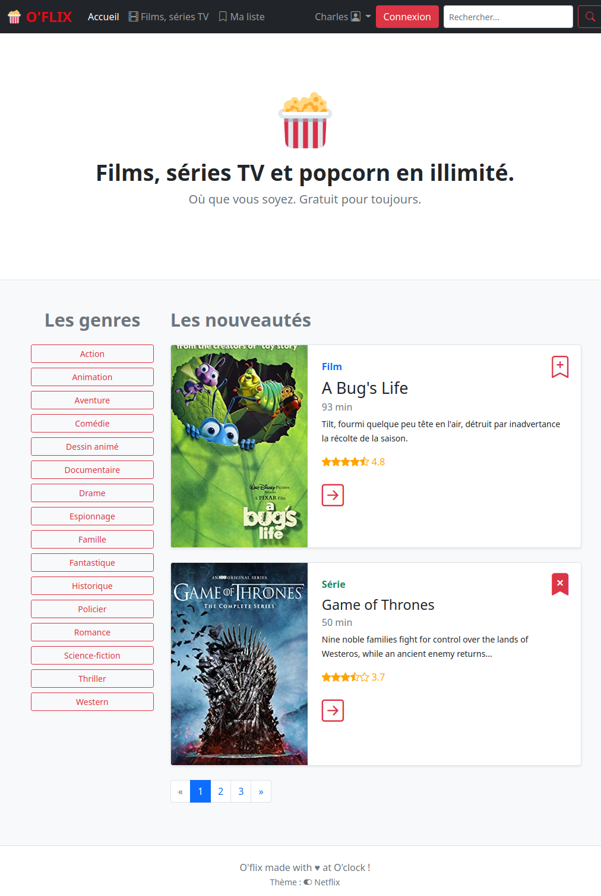
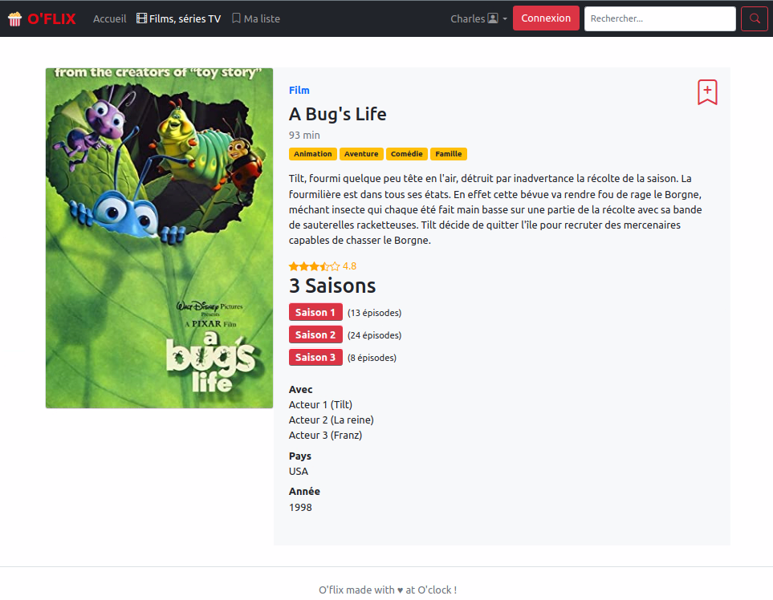
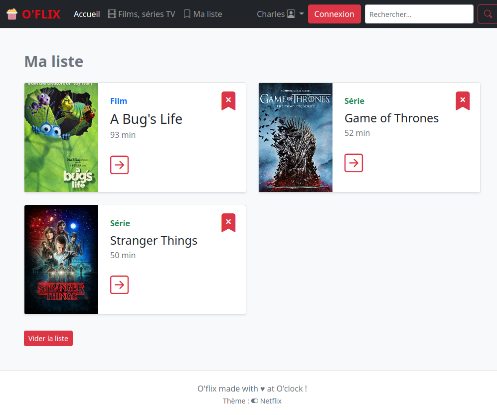
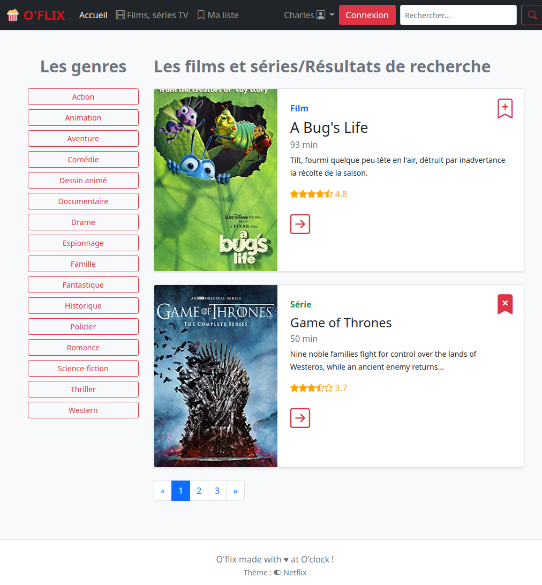

# Projet O'flix, Symfony Getting Started

Afin de prendre en main le framework Symfony, nous allons mettre en place un site qui répertorie des films et des séries ! Appelons-le O'flix.

Voici quelques captures et contenus fournis, pour entrevoir les fonctionnalités attendues. Les étapes de l'exercice sont détaillées ensuite.

## Intégration HMTL/CSS fournie

### 1. Page d'accueil



### 2. Page du film ou de la série



### 3. Page des favoris utilisateur



### 4. Liste des films ou des Résultats de recherche



---

### Objectifs

- Installer _Symfony Skeleton_
- L'enrichir au besoin via la documentation de Symfony section _Getting Started_, à l'aide de ce README.
- Parcourir la documentation Twig (moteur de templating)
- Créer un site entre Allociné et Netflix.

Vous travaillerez à partir de [la documentation Symfony : Getting Started](https://symfony.com/doc/current/index.html).

> :hand: **Toutes les infos sont contenues dans les chapitres du _Getting Started_**. _Pas besoin d'aller chercher les infos ailleurs_ pour le moment (je sais c'est tentant mais la doc Symfo sera notre bible prioritaire :pray:).

## Etapes de l'exercice

### Installation

Installer un nouveau projet Symfony _"skeleton"_, via _composer_, depuis votre dossier cloné :

- `composer create-project symfony/skeleton oflix ^6`

[remonter tous les fichiers de Symfony à la racine de votre dépôt cloné](https://kourou.oclock.io/ressources/fiche-recap/symfony-basics/#anchor-remonter-tous-les-fichiers-dun-niveau).
```bash
mv oflix/* oflix/.* .
```

Supprime le répertoire "oflix" vide:

```bash
rmdir oflix
```

> :hand: On peut utiliser le serveur PHP pour lancer l'appli Symfony : `php -S 0.0.0.0:8000 -t public`.
> 
> :hand: Ou passer par Apache, on installe le `.htaccess` via `composer require symfony/apache-pack` (répondre `y` à l'invite).

### Les routes

> :hand: Lister les pages attendues afin d'en déduire les routes (URL, contrôleur, méthode, paramètres, description). Les noter dans le fichier `routes.md` fourni dans le dossier _sources_.

> On commence par **la page d'accueil** et **la page du film/série**

### Les assets

Dans le dossier `public` copier les 2 sous-dossiers `css` et `images` du dossier `sources/html-css`.

> On s'occupera du fichier `data.php` dans quelques minutes.

> :hand: A ce stade la structure de notre site est en place, il ne nous reste plus qu'à attaquer le code !

---

### Intégration des templates HTML/CSS brutes

Nous allons, créer les contrôleurs, méthodes et templates nécessaires pour afficher les pages HTML/CSS dans notre appli Symfony. Nous les dynamiserons ensuite.

- Vous pourrez afficher les routes dans le terminal avec `debug:router`.
- Créer les contrôleurs, méthodes et templates associés afin de créer les pages d'accueil et du film.
- Pour ajouter Twig à Symfony, l'inclure au projet via `composer require twig` :paintbrush:

### Dynamisation : Page d'accueil

1. Récupérer la liste des films et la dumper via `dump()` depuis la page d'accueil.
   - Pour ce faire, trouver le moyen d'accéder aux données de **`data.php` (notre Model "statique")** (on cherchera une solution en PHP objet de préféfence :wink:). Pas de bases de données pour le moment, on verra ça dans quelques jours.
2. Dynamiser la vue associée (rubrique _Templates / Linking to Pages_). Une petite boucle `for` ?

> Vous souhaitez des infos sur l'exécution de votre code ? => `composer require profiler` :tada:

### Dynamisation : Liens

Dans la boucle du template de liste :

1. Afficher le poster de chaque film (rubrique _Templates > Linking to CSS, JavaScript and Image Assets_).
2. Générer des liens avec l'id du film concerné (rubrique _Templates > Linking to Pages_). Trouver le moyen d'identifier un film depuis le tableau.

### Dynamisation : Page du film

1. Récupérer l'index du film à afficher depuis l'URL et le dumper pour vérification (rubrique _Routing / Generating URLs_).
2. Récupérer les données du film, les transmettre à la vue et dynamiser le template (rubrique _Templates / Twig_).
   - Créer la vue associée avec l'héritage du layout principal (dont l'en-tête sera noire et pas jaune pour le moment).
3. Que faire si l'index n'existe pas dans les data ? (pensez _"HTTP"_ cf rubrique _Controllers_)

### Routes (suite)

Que faire si le paramètre `id` de la route `show` n'est pas au format numérique ? Ou encore, essayez de passer une chaine de caractères dans l'URL pour voir ce qui se passe.

- Trouver le moyen de mettre des contraintes sur les paramètres de routes, ici sur l'id du film qui doit être un entier (rubrique _Routing > Parameters Validation_).

### API

Cela n'est pas précisé dans les captures mais vous pourriez proposer un accès API/JSON qui renvoie les données des films/séries vers une appli front.

- Récupérer l'ensemble des data et les encoder en JSON (rubrique _Controllers > Returning JSON Response_).

### Favoris

Sans base de données, proposer un sélection de favoris que l'on stockera en session coté serveur.

[Lire le README pour la gestion des favoris](README-Favorites.md)

## Lectures

- Parcourir [les conventions de codage et de nommage de Symfony](https://symfony.com/doc/current/contributing/code/standards.html).  
Elles vous permettront d'avoir **une base pour l'écriture de votre code**.
- [Les fondamentaux HTTP, vus par Symfony](https://symfony.com/doc/current/introduction/http_fundamentals.html).

## Bonus

### *Theme switcher*

En bonus, on pourra créer un _theme switcher_ (sélecteur de thème) pour choisir le thème Netflix ou Allociné (voir le bouton dans le pied de page).
On le notera par un **changement de couleur de la nav** : Netflix en noir / Allociné en jaune.

> Ce bonus sert principalement à s'exercer avec les concepts de Symfony, la gestion d'un thème se faisant plutôt côté client (cookie, LocalStorage) ou le cas échéant dans le profil de l'utilisateur côté back, à voir quand on découvrira l'usage des bases de données.

[Plus d'info par ici](README-Theme-switcher.md)
