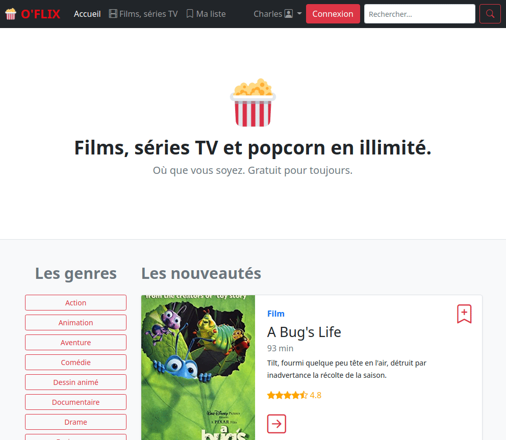

# Liste de favoris O'flix

## Objectifs

- Créer une liste de favoris temporaire pour l'utilisateur courant.
- Mettre en place les bonnes pratiques de développement web.

## Démo de la fonctionnalité

### Page liste

Si pas déjà fait, intégrer la page HTML/CSS fournie via contrôleur/méthode/template.

### Ajouter à la liste

Pour cela on va faire appel à la session Symfony.

&lt;/Exercice&gt;

- Au niveau de l'icône de marque-page, faire en sorte de pouvoir exécuter une méthode HTTP POST, vers l'URL d'ajout à la liste.
- On va stocker en session, les infos du film. On veut pouvoir y ajouter tous les films. On va donc stocker ces infos dans un tableau.
- Comment procéder avec la session, à l'ajout : _on récupère le panier de la session, on y ajoute les infos demandées, on remet le nouveau panier dans la session_. Voir [Session > Basic Usage > *From a Symfony controller*](https://symfony.com/doc/current/session.html#session-intro)
  - Une fois le traitement effectué, [rediriger vers la page voulue](https://symfony.com/doc/current/controller.html#redirecting).
- Sur la page "Ma liste", on récupère et on dump le panier qui est en session pour s'assurer que ça fonctionne bien.
- **Ajouter les pré-requis sur les méthodes GET, POST ou les deux pour chaque méthode de contrôleur**, voir [requirements => Adding HTTP method requirements](https://symfony.com/doc/current/routing.html#matching-http-methods).
- **Définir des requirements** sur toutes les routes où c'est nécessaire : [_requirements_](https://symfony.com/doc/current/routing.html#parameters-validation) et les Regex).

    &lt;Bonus&gt;

  - Afficher les informations de chaque film/série présent dans la session.
  - Trouver un moyen, à l'ajout à la liste, d'éviter les doublons (chaque film/série ne doit être ajouté qu'une seule fois !).
  - **Ajouter des _[Flash Messages](https://symfony.com/doc/current/session.html#flash-messages)_** dans les contrôleurs sur les actions d'ajout/suppression à la liste.

  > _Les messages Flash sont des variables stockées en session. Leur particularité est que, dès qu’ils ont été récupérés, ils sont aussitôt supprimés de la session. Parfait pour envoyer une notification juste après une opération)_. Cela fait en outre partie des bonnes pratiques Opquast :nerd_face: cf BP 97 et BP 98 (formulaires : message et redirection)

  - Afficher les flash messages sur la destination de la redirection (ou dans le layout global mais cela peut être moins précis). Faire en sorte d'appliquer le style [Alert Bootstrap](https://getbootstrap.com/docs/5.1/components/alerts/) correspondant.

    &lt;/Bonus&gt;

&lt;/Exercice&gt;

- **Effectuer les vérifications de validité de certaines actions** (comme _/show/4_ par ex.) : [Renvoyer une 404](https://symfony.com/doc/current/controller.html#managing-errors-and-404-pages) si la ressource demandée n'existe pas. Identifier toutes les routes où la 404 peut être envoyée.

### Suppression des favoris

- Pour l'action _remove_ de la liste, **utiliser également une méthode POST** (un formulaire donc).
- Conditionner les actions ajouter/supprimer sur chaque fiche film/série, selon la présence ou non du film courant dans les favoris.

### Templates

- Y'a-t-il besoin de réutiliser des portions de templates Twig/HTML sur plusieurs templates ?
- Si oui, jetez un oeil du côté de [l'include de Twig](https://symfony.com/doc/current/templates.html#including-templates) (partial, fragment).
- Mettre un titre HTML (balise `title`) différent à chaque page (héritage Twig).

### Bonus

- Rendre la sélection du menu dynamique (CSS active), selon la route de la page courante.
  - Possibilité 1 : Twig et la variable globale [`app`](https://symfony.com/doc/current/templates.html#the-app-global-variable)
  - Possibilité 2 : Il existe peut-être une autre solution, directement liée au système de template Twig...

### Mega Bonus

- Modifier le code actuel pour pouvoir réaliser les modifications de la liste en AJAX/fetch.
